

<h1>CSc 8830: Computer Vision</h1>

Module 5&ndash;6 &mdash; Optical Flow, Motion Tracking, Bilinear Interpolation, and Structure From Motion

Georgia State University 
GitHub repository: <a href="https://github.com/minnocent12/csc8830-module-5-6">github.com/minnocent12/csc8830-module-5-6</a> 
Report generated from real, saved experimental results 
September 30, 2026

## 1. Introduction

This report covers Module 5&ndash;6 of the CSc 8830 Computer Vision course, which combines two
assignment questions built on classical, non-learned computer-vision methods:

- **Question 1 &mdash; Optical Flow and Motion Tracking.** Using two real user-captured videos,
  each with at least a 30-second sample containing motion: compute dense optical flow and
  visualize it as a video; explain what information the optical flow reveals, with evidence;
  derive the two-frame motion-tracking equations from fundamentals; derive bilinear
  interpolation; and validate the theoretical (algorithmic) tracking prediction against an
  actual, manually observed pixel location on two consecutive frames from each video.
- **Question 2 &mdash; Structure From Motion.** Using four real photographs of one flat/2D
  planar object taken from four different camera viewpoints: recreate the object's boundary
  points so the boundary can be estimated, show the required mathematical workouts, and report
  the images used together with camera position and camera parameter information.

Both questions were implemented in Python with OpenCV, NumPy, and Matplotlib, exposed through
a Streamlit web application, and validated first against synthetic software-verification
fixtures with known answers before being run on the real assignment data. Every experimental
number in this report &mdash; video metadata, optical-flow statistics, tracked pixel
coordinates, homographies, reprojection errors, boundary coordinates &mdash; was produced by
that real pipeline and is traceable to a saved JSON/PNG artifact in the repository; none of it
was invented or estimated to "fill in" an incomplete measurement. Where a quantity is
genuinely unavailable (the calibrated camera intrinsic matrix, exact camera pose), this report
states that plainly rather than approximating it.

## 2. Software and Experimental Environment

| Component | Version / detail |
| --- | --- |
| Language | Python 3.10+ |
| Core CV library | OpenCV (`opencv-python`) &ge; 4.8 |
| Numerical computing | NumPy &ge; 1.24 |
| Plotting | Matplotlib &ge; 3.7 |
| Image handling | Pillow (EXIF extraction) &ge; 10.0 |
| Web application | Streamlit &ge; 1.30 |
| Testing | pytest &ge; 8.0 (187 automated tests, all passing at the time of this report) |
| Camera (all six real inputs) | Video 1/2: unspecified smartphone camera (see Section 3); SfM views: Apple iPhone 15 Pro Max, real EXIF |

**GitHub repository:** <https://github.com/minnocent12/csc8830-module-5-6> &mdash; public, verified
accessible.

**Public web application.** The module's own standalone Streamlit app runs independently with
`streamlit run app.py` and is also wired into the course's shared dashboard
(<https://csc8830-dashboard-minnocent1.streamlit.app>) through the same page-provider pattern
used by the course's other modules. At the time of writing, whether the public dashboard link
has finished redeploying with this module's latest code has not been independently confirmed
from within the repository's own tooling, so this report cites the GitHub repository as the
authoritative, verified source and does not claim the public link's current state.

The two Question 1 videos and the four Question 2 photographs are real files captured for this
assignment; because of their size (up to ~256&nbsp;MB per video) and personal nature, the
original files are excluded from the Git repository (`.gitignore`) by the project's stated
policy, while every derived result &mdash; frames, visualizations, JSON summaries, and
homography/boundary data &mdash; is committed and is what this report's figures and tables are
built from.

## 3. Input Data

### 3.1 Video 1 (`IMG_7272.MOV`)

| Field | Value |
| --- | --- |
| Resolution | 2160 &times; 3840 (portrait) |
| Frame rate | 29.997 fps |
| Total frames | 983 (32.77 s) |
| Optical-flow sample used | 0.0&ndash;30.0 s, frames 0&ndash;900 (899 consecutive frame pairs) |
| Content | A person walks into and around a room; motion is present for essentially the whole clip |

### 3.2 Video 2 (`IMG_7275.MOV`)

| Field | Value |
| --- | --- |
| Resolution | 2160 &times; 3840 (portrait) |
| Frame rate | 29.991 fps |
| Total frames | 1355 (45.18 s) |
| Optical-flow sample used | 10.0&ndash;40.11 s, frames 300&ndash;1203 (902 consecutive frame pairs) |
| Content | A backpack with a printed "TRAILMAKER" logo is held close to the camera and moved by hand |

Both samples exceed the assignment's 30-second minimum. Each interval was chosen from a
frame-difference motion scan (0.5 s resolution) of the whole video, selecting a clean
&ge;30-second window with sustained visible motion; Video 2's window was additionally chosen
so that it contains the two-consecutive-frame pair used for the manual tracking validation in
Section 8 (see `docs/EXPERIMENTAL_RESULTS.md` Section 1 for the full motion-scan discussion).

### 3.3 Four-view planar object (`IMG_7283.JPG`&ndash;`IMG_7286.JPG`)

The Question 2 object is the front cover of a paperback book (*The Tempest*, William
Shakespeare, Folger Shakespeare Library "Updated Edition"): a flat, richly textured, printed
surface, chosen specifically to satisfy the assignment's flat/2D-planar-object simplification
and to give ORB features strong, well-textured structure to match against.

All four photographs were taken with the same device and lens &mdash; confirmed from real EXIF
metadata, not assumed &mdash; within 72 seconds of each other, which supports treating the four
images as views of one stationary object under one capture session:

| View | File | Real EXIF camera/lens | Capture time | Approximate position (user-recorded) |
| --- | --- | --- | --- | --- |
| 1 (reference) | `IMG_7283.JPG` | Apple iPhone 15 Pro Max, 6.765 mm, f/1.78, 1/60 s, ISO 400 | 15:26:16 | Centered/front, aimed toward object center, ~9 in (0.229 m) |
| 2 | `IMG_7284.JPG` | Apple iPhone 15 Pro Max, 6.765 mm, f/1.78, 1/60 s, ISO 320 | 15:26:34 | Left-side, aimed back toward center, ~26 in (0.660 m) |
| 3 | `IMG_7285.JPG` | Apple iPhone 15 Pro Max, 6.765 mm, f/1.78, 1/60 s, ISO 320 | 15:26:56 | Right-side, aimed back toward center, ~26 in (0.660 m) |
| 4 | `IMG_7286.JPG` | Apple iPhone 15 Pro Max, 6.765 mm, f/1.78, 1/60 s, ISO 400 | 15:27:28 | Vertically displaced/angled, aimed toward object, ~26 in (0.660 m) |

Distances are exactly the user's stated approximate measurements (converted inches to meters);
they are not reported more precisely than that, and no calibrated camera pose was derived from
them. Each image is 4284&times;5712 px after correcting for its EXIF `Orientation=6` tag (the
sensor stores raw landscape pixels; the tag says to rotate 90&deg; for correct display &mdash;
handled explicitly and deterministically in code rather than relying on a given OpenCV build's
own default behavior, so pixel coordinates reported later in this report match what is seen
when viewing the photos normally).

## 4. Optical Flow Theory and Derivation

*(Full derivation: `docs/OPTICAL_FLOW_THEORY.md`.)*

### 4.1 Brightness constancy

Classical optical flow starts from the assumption that a point's brightness does not change as
it moves between frames &mdash; only its position does. If a point at $(x, y)$ at time $t$
moves by $(\Delta x, \Delta y)$ over a small interval $\Delta t$:

$$I(x, y, t) = I(x + \Delta x,\; y + \Delta y,\; t + \Delta t)$$

This is an idealization: it ignores illumination changes, specular highlights, and occlusion,
which is exactly where optical flow becomes unreliable in practice.

### 4.2 First-order Taylor expansion and the optical-flow constraint

Expanding the right-hand side to first order around $(x, y, t)$:

$$I(x+\Delta x,\, y+\Delta y,\, t+\Delta t) \approx I(x,y,t) + I_x \Delta x + I_y \Delta y + I_t \Delta t$$

where $I_x = \partial I/\partial x$, $I_y = \partial I/\partial y$, $I_t = \partial I/\partial t$
are the image's spatial and temporal partial derivatives. Substituting into brightness
constancy, subtracting $I(x,y,t)$ from both sides, dividing by $\Delta t$, and defining the
instantaneous pixel velocity $u = \Delta x/\Delta t$, $v = \Delta y/\Delta t$ gives the
**optical-flow constraint equation** (independently derived in this form by Lucas and Kanade
[1] and by Horn and Schunck [2]):

$$I_x u + I_y v + I_t = 0$$

This single scalar equation relates the measurable image gradients to the unknown motion
$(u, v)$ at one pixel.

### 4.3 The aperture problem

Rearranged, $I_x u + I_y v = -I_t$ is one linear equation in two unknowns: it constrains only
the motion component **along** the local gradient direction, leaving the component
**perpendicular** to it completely unconstrained. This is the classical **aperture problem**:
viewed through a small aperture, a moving edge's true motion cannot be distinguished from any
other motion sharing the same gradient-direction component. Lucas and Kanade [1] resolve this
by assuming neighboring pixels in a small window share approximately the same motion.

### 4.4 Lucas&ndash;Kanade derivation

*(Full derivation, including the eigenvalue/feature-quality connection and the relationship to
OpenCV's pyramidal implementation: `docs/MOTION_TRACKING_DERIVATION.md`.)*

Writing the constraint equation at each of $n$ pixels $p_1, \dots, p_n$ in a small window under
the local constant-motion assumption gives an overdetermined linear system $A\,\mathbf{v} = b$:

$$
A = \begin{bmatrix} I_x(p_1) & I_y(p_1) \\ I_x(p_2) & I_y(p_2) \\ \vdots & \vdots \\ I_x(p_n) & I_y(p_n) \end{bmatrix}, \qquad
b = \begin{bmatrix} -I_t(p_1) \\ -I_t(p_2) \\ \vdots \\ -I_t(p_n) \end{bmatrix}, \qquad
\mathbf{v} = \begin{bmatrix} u \\ v \end{bmatrix}
$$

Solved by least squares via the normal equations:

$$A^{T} A\, \mathbf{v} = A^{T} b \qquad\Longrightarrow\qquad \mathbf{v} = (A^{T} A)^{-1} A^{T} b$$

valid when the $2\times2$ **structure tensor** $A^{T}A$ is invertible &mdash; i.e., both
eigenvalues are large enough. This is precisely the criterion Shi and Tomasi's "Good Features
to Track" [3] use to select points worth tracking, and that OpenCV's `minEigThreshold`
parameter uses to reject unreliable tracks: feature detection and tracking reliability are two
views of the same structure-tensor conditioning problem.

**Two-frame tracking problem.** Let $F_1 = I(x,y,t)$ and $F_2 = I(x,y,t+\Delta t)$ be two
consecutive frames. A point $P=(x,y)$ in $F_1$ is expected, under brightness constancy and
small motion, to appear at

$$P' = (x+u,\; y+v)$$

in $F_2$. The tracking problem is: **find $(u,v)$ such that $F_1(x,y) \approx F_2(x+u, y+v)$.**
This is exactly the problem `module5_6.tracking.track_points` solves for a set of points
between two consecutive frames (Section 7), using OpenCV's pyramidal, iterative
`cv2.calcOpticalFlowPyrLK` [4], which implements Bouguet's coarse-to-fine refinement [5] of this
same windowed least-squares model rather than a single-resolution solve.

## 5. Optical Flow Implementation

Dense optical flow is computed with OpenCV's Farneb&auml;ck polynomial-expansion algorithm [6]
(`cv2.calcOpticalFlowFarneback`, wrapped by `module5_6.optical_flow.compute_farneback_flow`),
which estimates a full per-pixel $(u,v)$ field between two grayscale frames rather than at a
sparse set of tracked points. The pipeline for each consecutive frame pair is:

1. Convert both frames to grayscale.
2. Compute the dense Farneb&auml;ck flow field.
3. Compute per-pixel magnitude ($\sqrt{u^2+v^2}$) and direction ($\operatorname{atan2}(v,u)$).
4. Visualize as either an **HSV-color** encoding (hue = direction, value = magnitude,
   normalized to the frame pair's own maximum) or an **arrow/vector overlay** sampled on a
   configurable grid, thresholded to suppress near-zero arrows.
5. Write each visualized frame pair to an output video (Question 1's "visualize the same as a
   video" requirement).

**A real engineering problem and its fix.** The first implementation of this pipeline read an
entire video sample into memory as a Python list of raw BGR frames before processing. At native
4K resolution and ~30 fps, a 30-second sample is on the order of 900 frames; a list of that many
raw BGR frames requires tens of gigabytes of RAM, and running this against the real
`IMG_7272.MOV`/`IMG_7275.MOV` files was observed to trigger an out-of-memory process kill. The
fix was to change the frame source from a materialized list to a generator
(`module5_6.video.iter_frame_range`) and to compute, visualize, and write one frame pair at a
time (`render_optical_flow_video_from_path`), making memory use $O(1)$ in the number of frames
instead of $O(n)$. Magnitude statistics (mean, max) are likewise aggregated as a running
sum/count and running max across frame pairs, without ever holding every pixel's magnitude from
every frame pair in memory simultaneously; the reported median is documented as the median *of
each frame pair's own median* &mdash; a deliberate, stated approximation of the true global
median, not an exact value, made for the same memory reason (see `module5_6.video`'s
docstrings).

## 6. Optical Flow Experiments and Results

Both videos' 30-second samples (Section 3) were processed end-to-end with
`scripts/process_optical_flow.py`, which drives the streaming implementation above. Every
number below is read directly from the saved
`results/optical_flow/video_{1,2}/video_{1,2}_optical_flow_summary.json` files, not retyped
from memory.

**Table 1.** Optical-flow magnitude statistics (real, computed).

| Statistic | Video 1 | Video 2 |
| --- | --- | --- |
| Mean magnitude (px/frame) | 0.277 | 0.383 |
| Median magnitude (px/frame, approx.)$^\dagger$ | 0.186 | 0.040 |
| Max magnitude (px/frame) | 155.106 | 434.974 |
| Frame pairs | 899 | 902 |

$\dagger$ Approximate for the reason given in Section 5 (median of per-frame-pair medians, not
the exact global pixel-level median); mean and max are exact.

<figure>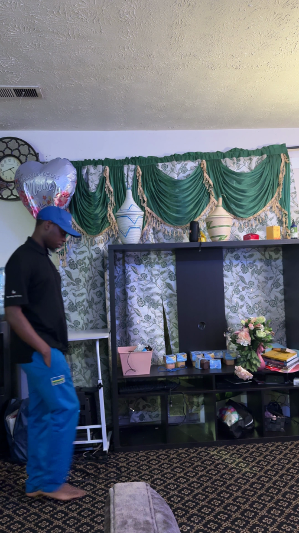<figcaption>Fig. 1a. Video 1, frame 275: original frame.</figcaption></figure>
<figure>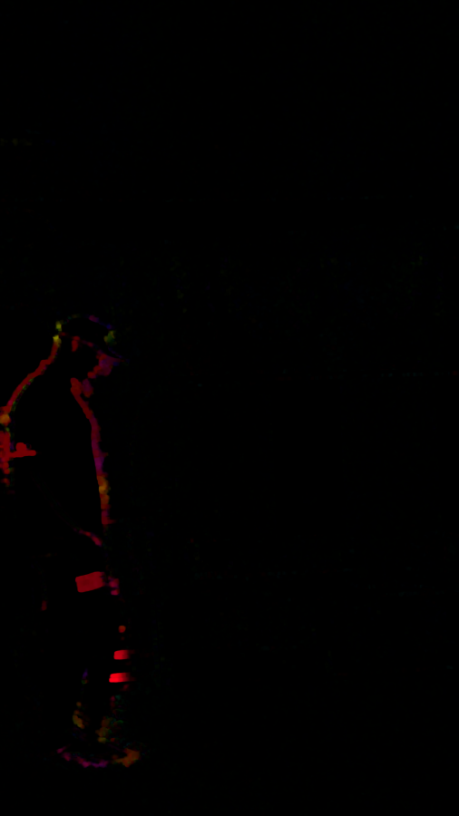<figcaption>Fig. 1b. Video 1, frames 275&rarr;276: HSV flow (hue = direction, value = magnitude).</figcaption></figure>
<figure>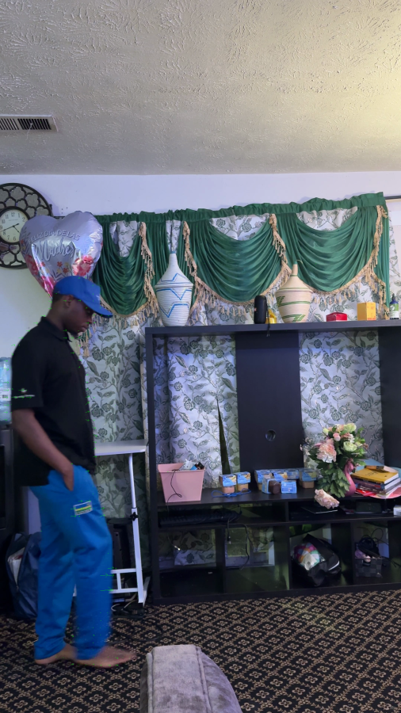<figcaption>Fig. 1c. Video 1, frames 275&rarr;276: arrow overlay.</figcaption></figure>

<figure>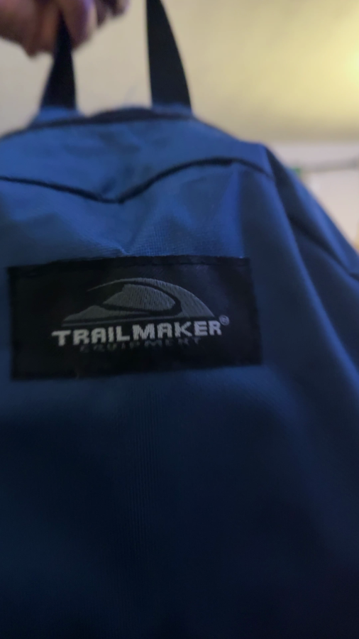<figcaption>Fig. 2a. Video 2, frame 1200: original frame.</figcaption></figure>
<figure>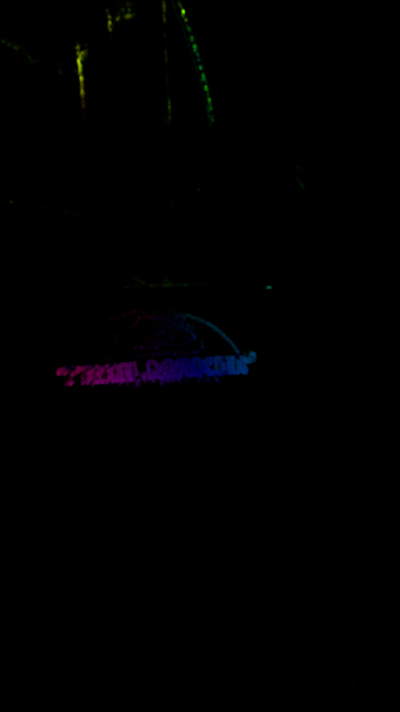<figcaption>Fig. 2b. Video 2, frames 1200&rarr;1201: HSV flow.</figcaption></figure>
<figure>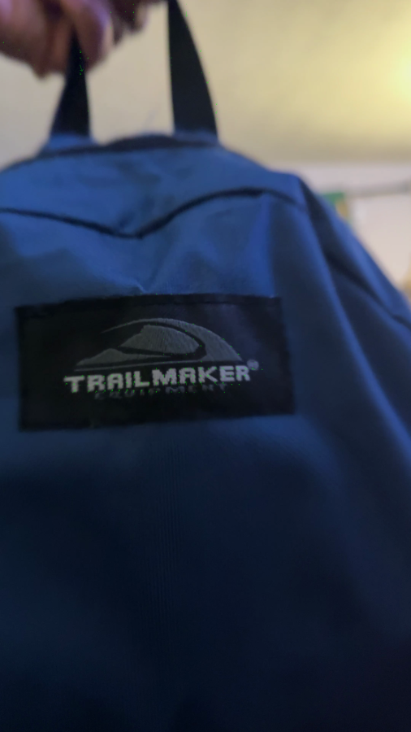<figcaption>Fig. 2c. Video 2, frames 1200&rarr;1201: arrow overlay.</figcaption></figure>

### 6.1 What can be inferred (claims tied to the evidence above)

- **Moving vs. static regions.** In both videos, Figures 1b/1c and 2b/2c show flow correctly
  concentrated on the moving subject (the walking person in Video 1; the hand/strap/logo region
  in Video 2), while the static background (walls, furniture) shows near-zero flow. This is a
  direct, visually verifiable observation from the evidence frames, not an inference from the
  magnitude numbers alone.
- **Relative motion magnitude.** Video 2's close-up handheld footage produces a far larger peak
  displacement (434.97 vs. 155.11 px/frame) than Video 1's whole-body walking shot &mdash;
  consistent with the subject/camera being much closer to the lens in Video 2 (the same
  real-world motion covers more pixels when closer to the camera) and with faster hand/arm
  motion than walking pace.
- **Camera motion.** Video 2's much lower median magnitude despite its highest mean and max is
  consistent with a handheld shot that tracks its subject: most background pixels show little
  apparent motion between consecutive frames, while the subject itself (and any camera shake)
  produces localized spikes.
- **Where flow becomes less reliable.** The tracking-validation results in Section 8 (8.4 px
  error for Video 2's point vs. 4.6 px for Video 1's) suggest tracking is somewhat less reliable
  in Video 2's sample: its tracked feature (a small printed letter) is smaller in frame and more
  affected by motion blur under indoor lighting than Video 1's larger silhouette edge. This is
  an observation about these two specific measurements, not a general claim about either video.

No claim is made about acceleration, directional trends over the full sample, or
foreground/background segmentation beyond what is directly visible in the evidence frames and
the two point measurements in Section 8; a full frame-by-frame directional analysis was not
performed. Full write-up: `docs/EXPERIMENTAL_RESULTS.md`.

## 7. Motion Tracking

Sparse point tracking uses **Shi&ndash;Tomasi** corner detection [3] (`cv2.goodFeaturesToTrack`,
`module5_6.tracking.detect_features`) to select trackable points on Frame 1, then **pyramidal
Lucas&ndash;Kanade** tracking [1][5] (`cv2.calcOpticalFlowPyrLK`,
`module5_6.tracking.track_points`) to estimate each point's location in Frame 2, exactly
implementing the two-frame tracking problem of Section 4.4. For each tracked point the
implementation also computes:

- **Displacement vectors** $(u, v) = P' - P$ and their magnitude, visualized as arrows from
  Frame 1 to the tracked Frame 2 location.
- **Forward&ndash;backward consistency.** Each point is tracked forward ($F_1 \to F_2$) and then
  the resulting point tracked backward ($F_2 \to F_1$); a large drift between the original and
  round-tripped location flags an unreliable track (`module5_6.tracking.forward_backward_validate`).

**Three distinct error/consistency quantities must not be confused**, and this report keeps
them explicitly separate throughout:

1. **OpenCV's own per-point tracking error** (`TrackedPoints.error`) &mdash; an algorithmic
   measure of how well the pyramidal LK solver's internal model fit at that point; it never
   looks at Frame 2 as a real image beyond what the tracker itself already used.
2. **Forward&ndash;backward consistency error** &mdash; a self-consistency check with the same
   property: it never compares against an independently, manually observed location.
3. **The professor-required pixel-location validation error** (Section 8) &mdash; the only one
   of the three that compares the algorithm's predicted location against a location a human
   actually observed by looking at Frame 2.

Quantities 1 and 2 are real, useful diagnostic signals reported live by the Motion Tracking
page for whatever video is uploaded; they are not, and are never presented as, the
assignment's required validation.

## 8. Real Two-Frame Tracking Validation

*(Full procedure, coordinate convention, and point-selection method: `docs/TRACKING_VALIDATION.md`.)*

**Coordinate convention.** Origin at the top-left corner of the frame; $x$ increases rightward
(column index), $y$ increases downward (row index); frame indices are 0-based from the start of
the sample interval.

**Procedure.** For a Frame 1 point $P=(x_1,y_1)$: (a) compute the *predicted* Frame 2 location
$(\hat{x}_2,\hat{y}_2)$ using pyramidal Lucas&ndash;Kanade on that one point (the
theoretical/algorithmic result); (b) separately, a human visually inspects the actual Frame 2
image (via a zoomed crop) and records the *observed* location $(x_2,y_2)$ &mdash; a real
measurement that must come from looking at the image, never from copying the prediction; (c)
compute the Euclidean pixel error:

$$e = \sqrt{(\hat{x}_2 - x_2)^2 + (\hat{y}_2 - y_2)^2}$$

**Table 2.** Real validation results (source: `results/tracking/video_{1,2}/P1_record.json`).

| Video | Point | Frames | Frame&nbsp;1 $(x_1,y_1)$ | Predicted Frame&nbsp;2 $(\hat{x}_2,\hat{y}_2)$ | Observed Frame&nbsp;2 $(x_2,y_2)$ | Pixel error $e$ |
| --- | --- | --- | --- | --- | --- | --- |
| Video 1 | P1 | 275&rarr;276 | (205.00, 1705.00) | (226.35, 1705.43) | (225.00, 1701.00) | **4.628 px** |
| Video 2 | P1 | 1200&rarr;1201 | (1127.00, 1964.00) | (1115.61, 1950.74) | (1110.00, 1957.00) | **8.408 px** |

**Euclidean error calculation, Video 1, P1** (independently re-verified for this report):

$$e = \sqrt{(226.348 - 225.000)^2 + (1705.427 - 1701.000)^2} = \sqrt{1.348^2 + 4.427^2} = \sqrt{1.817 + 19.598} = \sqrt{21.415} = 4.628 \text{ px}$$

**Point descriptions.** *Video 1, P1* is the silhouette peak/notch of the person's shirt
collar against the plain wall background, at frame 275 of the 0&ndash;30 s sample ($t\approx
9.17$ s) &mdash; a real, high-contrast, unambiguous edge feature, confirmed manually after
Shi&ndash;Tomasi detection on the silhouette. *Video 2, P1* is the notch apex of the letter "K"
(where its diagonal arms meet its vertical stroke) in the printed "TRAILMAKER" logo on the
backpack, at frame 1200 ($t=40.01$ s, inside the declared 10.0&ndash;40.11 s sample); earlier
candidate points elsewhere in the same window were too motion-blurred at native 4K resolution
under dim indoor lighting to confidently and reproducibly identify in both frames by eye, so
this clearer moment was used instead. Additional candidate second points for each video were
evaluated but rejected for the same reason (ambiguous or motion-blurred at native resolution);
per the assignment's "at minimum" allowance, one defensible real point per video is reported.

<figure>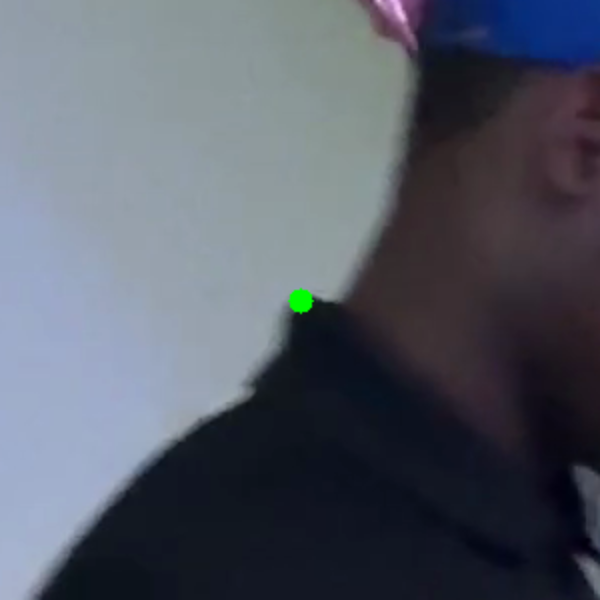<figcaption>Fig. 3a. Video 1, Frame 275 (zoomed): the selected point P1.</figcaption></figure>
<figure>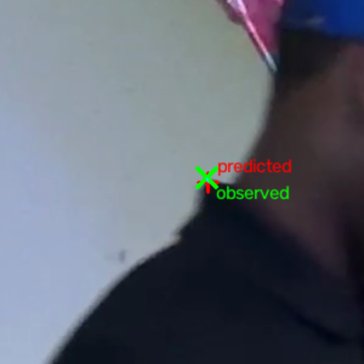<figcaption>Fig. 3b. Video 1, Frame 276 (zoomed): predicted (red) vs. observed (green).</figcaption></figure>

<figure>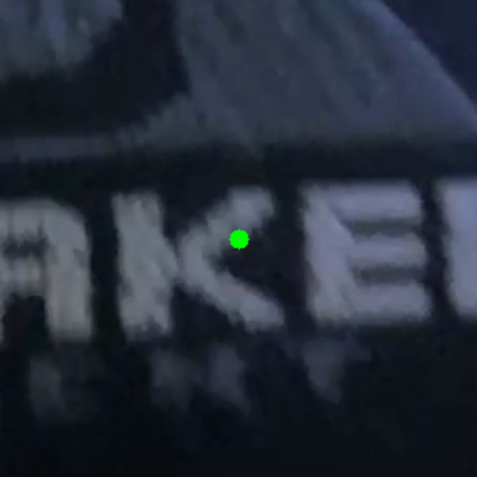<figcaption>Fig. 4a. Video 2, Frame 1200 (zoomed): the selected point P1.</figcaption></figure>
<figure>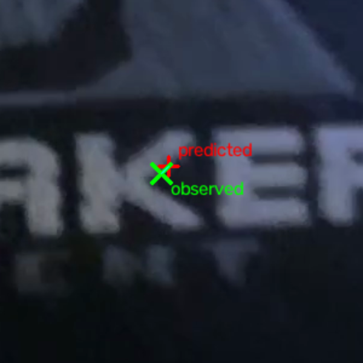<figcaption>Fig. 4b. Video 2, Frame 1201 (zoomed): predicted (red) vs. observed (green).</figcaption></figure>

**Reading the results.** Both errors are small relative to the frame's 2160&times;3840
resolution and to each point's own predicted displacement (21.3 px for Video 1, 17.5 px for
Video 2) &mdash; in both cases the Lucas&ndash;Kanade prediction landed within roughly a
quarter of the true displacement's magnitude of the manually observed location. Video 2's error
is roughly double Video 1's, plausibly because its feature (a small printed letter, close to
the camera, under dim indoor lighting) is smaller and more affected by motion blur than Video
1's larger-scale silhouette edge. This characterizes only these two specific measurements and
is not generalized into a broader tracking-accuracy claim; see `docs/TRACKING_VALIDATION.md`
Section 5 for the full limitations discussion.

## 9. Bilinear Interpolation

*(Full derivation and boundary-behavior discussion: `docs/BILINEAR_INTERPOLATION.md`.)*

A tracked point's estimated location is generally a fractional coordinate, not aligned to the
integer pixel grid. Bilinear interpolation estimates the value there from its four nearest
integer-pixel neighbors $I_{00}, I_{10}, I_{01}, I_{11}$ (top-left, top-right, bottom-left,
bottom-right), with fractional offsets $\alpha = x - x_0$, $\beta = y - y_0$.

**Derivation from two sequential 1D interpolations.** Interpolate along $x$ at each known row:

$$R_0 = (1-\alpha) I_{00} + \alpha I_{10}, \qquad R_1 = (1-\alpha) I_{01} + \alpha I_{11}$$

then interpolate along $y$ between the two row results:

$$I(x,y) = (1-\beta) R_0 + \beta R_1$$

Substituting and expanding gives the final weighted expression:

$$I(x,y) = (1-\alpha)(1-\beta)\,I_{00} + \alpha(1-\beta)\,I_{10} + (1-\alpha)\beta\,I_{01} + \alpha\beta\,I_{11}$$

**Why this matters for tracking:** without it, a tracked location like $(x,y) = (12.3, 8.7)$
would have to be rounded to an integer pixel, discarding the sub-pixel precision that
Lucas&ndash;Kanade's least-squares solution (Section 4.4) actually produces &mdash; bilinear
interpolation is the standard first-order way to read an intensity value, or compare a
predicted location against image content, at that fractional position [7].

**Numerical worked example** (a deterministic mathematical example with chosen round numbers,
**not** a measurement from any real assignment video): let $I_{00}=10$, $I_{10}=20$,
$I_{01}=30$, $I_{11}=40$, $\alpha=0.3$, $\beta=0.7$.

$$R_0 = 0.7(10) + 0.3(20) = 7.0 + 6.0 = 13.0, \qquad R_1 = 0.7(30) + 0.3(40) = 21.0 + 12.0 = 33.0$$
$$I(x,y) = 0.3(13.0) + 0.7(33.0) = 3.9 + 23.1 = \mathbf{27.0}$$

Cross-check with the expanded weight formula ($w_{00}=0.21$, $w_{10}=0.09$, $w_{01}=0.49$,
$w_{11}=0.21$, summing to 1.0):

$$I(x,y) = 0.21(10) + 0.09(20) + 0.49(30) + 0.21(40) = 2.1+1.8+14.7+8.4 = \mathbf{27.0}$$

Both routes agree at $I(x,y)=27.0$. This exact example is checked in
`tests/test_interpolation.py` against the actual implementation
(`module5_6.interpolation.bilinear_interpolate_corners`) and reproduced interactively on the
Bilinear Interpolation & Theory web page &mdash; it is an illustrative software-verification
example, not a real experimental result.

## 10. Structure From Motion Theory

*(Full derivations: `docs/CAMERA_GEOMETRY.md`, `docs/SFM_CALCULATIONS.md`,
`docs/STRUCTURE_FROM_MOTION_THEORY.md`.)*

### 10.1 Pinhole camera model and homogeneous coordinates

A 2D point $(x,y)$ is represented in homogeneous coordinates as $[x,y,1]^T$. A 3D world point
$P_w=[X,Y,Z,1]^T$ projects to homogeneous image coordinates $[u,v,1]^T$ (up to scale $s$) by

$$s\,[u,v,1]^{T} = K\,[R\mid t]\,P_w$$

where the **intrinsic matrix** $K$ encodes the camera's internal optics,

$$K = \begin{bmatrix} f_x & 0 & c_x \\ 0 & f_y & c_y \\ 0 & 0 & 1 \end{bmatrix},$$

$f_x,f_y$ the focal length in horizontal/vertical pixel units, $(c_x,c_y)$ the principal point;
and the **extrinsic parameters** $[R\mid t]$ (a $3\times3$ rotation and $3\times1$ translation)
give the camera's orientation and position relative to the world frame [8].

### 10.2 Camera parameters: what calibration requires

$K$ requires an actual calibration procedure (e.g., a checkerboard calibration) or a
manufacturer-reported focal length converted to pixel units using the sensor's real pixel
pitch &mdash; never simply the image's pixel dimensions. $R,t$ (camera pose) are not directly
observable without a calibration rig, fiducial markers, or (for a planar scene) the
homography-based route in Section 10.4, which itself still requires a known $K$ to separate
$R,t$ from $H$. This module never substitutes an invented value for either.

### 10.3 Point correspondence

Corresponding points between two views of the same object are obtained automatically with ORB
(Oriented FAST and Rotated BRIEF) [9] keypoint detection plus brute-force Hamming-distance
descriptor matching (`module5_6.features`), or manually when exact known coordinates are
needed (the boundary corners in Section 11).

### 10.4 Planar homography

Because Question 2's object is flat, its surface can be modeled as the plane $Z=0$ in its own
coordinate frame. For two pinhole views of the same plane with unit normal $n$ and
camera-to-plane distance $d$, the mapping between their image coordinates collapses to a single
$3\times3$ **homography** $H$ [8]:

$$s\,x' = Hx, \qquad H = K\!\left(R - \frac{t\,n^{T}}{d}\right)\!K^{-1}$$

This is why a flat object lets Question 2 skip a fundamental/essential-matrix pipeline
entirely: $H$ alone fully describes how the object's image warps between views, and can be
estimated directly from point correspondences via the **Direct Linear Transform (DLT)** [8]:
the projective relation $[u,v,1]^T \sim H[x,y,1]^T$ implies a zero cross product, giving two
linear equations per correspondence in the 9 unknown entries of $H$; stacking $n\ge4$
non-collinear correspondences gives a $2n\times9$ system solved (up to scale) by the smallest
right singular vector of its coefficient matrix. OpenCV's `cv2.findHomography` [12] implements
this directly, or wrapped in **RANSAC** [10] (`method="ransac"`, the default used throughout
this module),
which repeatedly fits a DLT solution to a random minimal subset of correspondences and keeps the
fit with the most inliers &mdash; discarding mismatched correspondences (from imperfect ORB
matches) rather than letting them corrupt the estimate.

### 10.5 Reprojection error and boundary reconstruction

After estimating $H$, the predicted location of each correspondence's source point is
$\hat{p}' = Hp$ (normalized from homogeneous coordinates). The reprojection error is the
Euclidean distance to the actually observed corresponding point, $e_i = \lVert p_i' -
\hat{p}_i' \rVert_2$, averaged over RANSAC inliers only (an outlier the estimator itself
rejected should not be allowed to dominate the reported error).

For a planar object with known boundary/corner points $P_1,\dots,P_4$ in a given view, the same
estimated homography that registers matched features also registers the boundary:
transforming $[P_1,\dots,P_4]$ by $H$ maps them into the reference view's frame. Combining every
view's registered boundary with the reference view's own boundary by a simple, transparent
unweighted mean gives one consensus estimate of the object's boundary in the reference frame
(Section 11.5).

**Terminology.** Everything in Sections 10&ndash;12 is a **planar Structure From Motion /
projective (homography) registration and boundary-recovery demonstration** &mdash; it does not
recover a 3D point cloud, does not estimate 3D camera rotation/translation independently of a
known $K$, and does not produce a depth map. It is explicitly not dense/full 3D reconstruction.

## 11. Four-View Real SfM Experiment

Processed end-to-end by `scripts/process_sfm_experiment.py` on the four real images described
in Section 3.3. ORB: 2000 max features per view. Matching: Lowe's ratio test [11], threshold
0.75 (see Section 11.3 below for why). Homography: RANSAC, 3.0 px reprojection threshold. Every
number in this section is read directly from `results/sfm/sfm_summary.json`.

### 11.1 Object

The front cover of the paperback book described in Section 3.3, treated as the flat/2D planar
object per the assignment's explicit simplification. The spine and page edges visible in the
oblique views (2&ndash;4) are real, correctly-photographed parts of the object but are not part
of the tracked plane.

### 11.2 Camera positions

Table given already in Section 3.3 (View, file, real EXIF, user-recorded approximate position).
**View 1** was chosen as the reference view: it is the centered/front viewpoint closest to the
object (~9 in) with the least perspective foreshortening of the front cover face, consistent
with the assignment's default-reference guidance.

### 11.3 Input images and feature matching

**Table 3.** ORB correspondence and RANSAC homography results, View $N$ &rarr; View 1.

| Registration | Candidate matches | Retained matches | RANSAC inliers | Inlier ratio | Mean reproj. error (inliers) | Median | Max |
| --- | ---: | ---: | ---: | ---: | ---: | ---: | ---: |
| View 2 &rarr; View 1 | 516 | 112 | 53 | 47.3% | 1.546 px | 1.495 px | 2.967 px |
| View 3 &rarr; View 1 | 409 | 30 | 7 | 23.3% | 0.877 px | 0.705 px | 1.954 px |
| View 4 &rarr; View 1 | 506 | 72 | 31 | 43.1% | 1.285 px | 1.134 px | 2.890 px |

**The View 3 matching challenge.** An initial run using only a fixed maximum-Hamming-distance
match filter (no ratio test) registered View 3 with just 7 of 324 retained matches as RANSAC
inliers (2.2%) &mdash; far below View 2/4's ~26&ndash;27% under the same filter. Inspecting the
match visualization showed correspondences concentrated on the cover's printed title text and
banner ("The Tempest", "UPDATED EDITION Folger SHAKESPEARE LIBRARY"), which contains
repeated/self-similar letterforms; at View 3's viewing angle, several different occurrences of
similar glyphs produced matches that looked locally plausible (a good best-distance score) but
were globally inconsistent with each other, which RANSAC correctly rejected as outliers in
bulk. Switching the match filter to **Lowe's ratio test** [11] &mdash; which keeps a match only
if its best distance is well below its second-best distance, directly detecting this kind of
ambiguity &mdash; reduced the retained match count for every view (fewer, more confident
candidates survive) but substantially increased every view's inlier *ratio*, most dramatically
View 3's (2.2%&nbsp;&rarr;&nbsp;23.3%). View 3's absolute inlier count (7) remains the lowest of
the three views and is reported here as the genuine result, not tuned away.

<figure><figcaption>Fig. 5. View 1 (reference): detected ORB keypoints.</figcaption></figure>
<figure>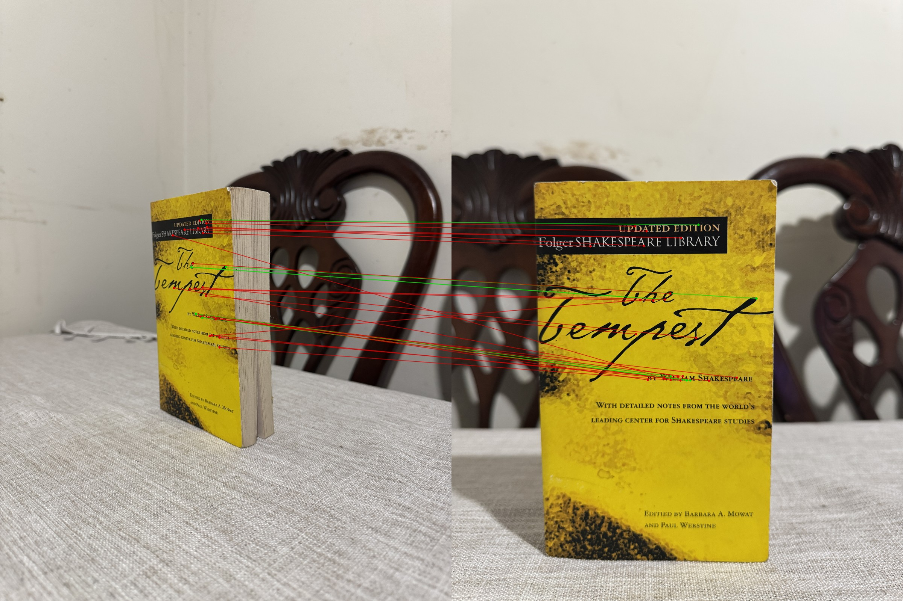<figcaption>Fig. 6. View 3&rarr;1 RANSAC-inlier matches (green) and outliers (red).</figcaption></figure>

<figure><figcaption>Fig. 7a. View 2 registered into View 1's frame via $H$.</figcaption></figure>
<figure><figcaption>Fig. 7b. View 3 registered into View 1's frame via $H$.</figcaption></figure>
<figure><figcaption>Fig. 7c. View 4 registered into View 1's frame via $H$.</figcaption></figure>

Each registered warp visibly rectifies the corresponding oblique photograph back to a
fronto-parallel appearance closely matching View 1's own framing &mdash; a direct visual
confirmation that the estimated homographies are geometrically sound, including View 3's,
despite its smaller inlier count.

### 11.4 Estimated homographies (full precision)

$$
H_{2\to1} = \begin{bmatrix} 1.201221 & 0.069267 & -2538.199839 \\ -0.275769 & 1.143748 & -466.000645 \\ -0.000108 & 0.0000076 & 1.0 \end{bmatrix}
$$
$$
H_{3\to1} = \begin{bmatrix} 5.916231 & -0.314393 & -6450.046180 \\ 1.275315 & 2.710262 & -4279.020051 \\ 0.000458 & -0.0000412 & 1.0 \end{bmatrix}
$$
$$
H_{4\to1} = \begin{bmatrix} 1.134006 & -0.208633 & -557.842503 \\ -0.079209 & 1.217266 & -1418.208290 \\ 0.0000036 & -0.000119 & 1.0 \end{bmatrix}
$$

Rounded to 6 decimals for display; **do not use these rounded values to hand-reproduce Section
12's worked example** &mdash; the bottom-row projective terms are small (~$10^{-4}$,
~$10^{-6}$) and the normalizing $q_3$ is a sensitive near-cancellation, so rounding them
changes the normalized result by several pixels. Full double-precision values (used for every
calculation in this report): `results/sfm/sfm_summary.json`.

### 11.5 Boundary corners and reconstructed boundary

Four boundary corners were manually identified in **every** view (not assumed to coincide with
ORB keypoints), pixel coordinates on the EXIF-orientation-corrected image, order top-left /
top-right / bottom-right / bottom-left, via a reproducible workflow: an HSV color threshold
plus connected-component analysis gives a coarse bounding box (the cover's distinctive
yellow/black print separates cleanly from the background), then each corner is confirmed by
visual inspection of a zoomed, pixel-grid-overlaid crop.

**Table 4.** Manually observed boundary corners (pixels).

| View | Top-left | Top-right | Bottom-right | Bottom-left |
| --- | --- | --- | --- | --- |
| 1 (reference) | (785, 1730) | (3055, 1698) | (2995, 5305) | (865, 5165) |
| 2 | (2450, 2140) | (3580, 2240) | (3470, 4345) | (2410, 4550) |
| 3 | (1480, 1885) | (2115, 1785) | (2225, 4225) | (1495, 3760) |
| 4 | (1440, 2280) | (2870, 2400) | (2665, 3760) | (1600, 3560) |

These are all **manually observed** coordinates &mdash; every view's own corners, read directly
off that view's image. The reconstructed reference-frame boundary is the unweighted mean of
View 1's own manual boundary and each of View 2/3/4's manual boundary **transformed by its own
homography** into View 1's frame (a **homography-predicted** value, explicitly distinguished
from the manual observations that produced it):

<figure><figcaption>Fig. 8. Reference-frame boundary reconstruction: red = View 1's own manual boundary; yellow = the four-view consensus (registered) boundary. The two agree closely (median corner disagreement ~64 px out of a ~4300&times;5700 px image).</figcaption></figure>

<figure><figcaption>Fig. 9. Normalized top-down rectification of View 1's cover using its own manual boundary as the target rectangle &mdash; a direct visual confirmation that the recovered boundary and homography geometry are consistent (the printed text appears horizontal and undistorted).</figcaption></figure>

### 11.6 Reprojection validation

Covered in Table 3 above (per-registration mean/median/max reprojection error over RANSAC
inliers) and Section 12 below (one specific point, hand-verified).

## 12. Real SfM Mathematical Workout

Using one real RANSAC-inlier correspondence from the View 2&rarr;View 1 registration (the first
inlier by descriptor-distance order). Source point in View 2, homogeneous:

$$p = \begin{bmatrix} 3062.880126953125 \\ 3085.920166015625 \\ 1 \end{bmatrix}$$

Applying the estimated homography $H_{2\to1}$ **at full precision** (the projective terms
$h_{31},h_{32}$ are small, ~$10^{-4}$ and ~$10^{-6}$, and $q_3$ is computed as a sensitive
near-cancellation, so the rounded 6-decimal display matrix in Section 11.4 is for readability
only &mdash; reproducing this workout by hand requires the full-precision values below or in
`results/sfm/sfm_summary.json`), $q = H_{2\to1}\,p$:

$$
\begin{aligned}
q_1 &= 1.201221344854071 \times 3062.880126953125 \;+\; 0.06926693687299869 \times 3085.920166015625 \;-\; 2538.199838680171 \\
    &= 1354.7493838797873
\end{aligned}
$$
$$
\begin{aligned}
q_2 &= -0.27576898035706154 \times 3062.880126953125 \;+\; 1.1437477768111421 \times 3085.920166015625 \;-\; 466.00064529011627 \\
    &= 2218.866354441155
\end{aligned}
$$
$$
\begin{aligned}
q_3 &= -0.00010774500481609414 \times 3062.880126953125 \;+\; 0.000007639348673605868 \times 3085.920166015625 \;+\; 1.0 \\
    &= 0.6935643860974214
\end{aligned}
$$

Normalizing (dividing by $q_3$):

$$
\begin{aligned}
x' &= q_1/q_3 = 1354.7493838797873 / 0.6935643860974214 = 1953.3145170598373 \\
y' &= q_2/q_3 = 2218.866354441155 / 0.6935643860974214 = 3199.221873150624
\end{aligned}
$$

This point's **actual observed** corresponding location in View 1 (from the same real ORB
match, not predicted) is $p'_{\text{actual}} = (1953.3316650390625,\ 3197.491943359375)$.
Reprojection error:

$$
\begin{aligned}
e &= \sqrt{(1953.314517-1953.331665)^2 + (3199.221873-3197.491943)^2} \\
  &= \sqrt{0.000294 + 2.992291} = \sqrt{2.992585} = 1.730 \text{ px}
\end{aligned}
$$

This $p$, $H_{2\to1}$, $q$, and $e$ were independently recomputed for this report with plain
scalar arithmetic (not calling the library's own homography-application function) at full
double precision, and matched the pipeline's own saved output exactly
(`results/sfm/sfm_summary.json` &rarr; `mathematical_workout_real_data`). This is the real
assignment mathematical workout; the deterministic examples in Sections 4 and 9 are explanatory
illustrations only, never presented as this result.

## 13. Camera Parameters and Limitations

| Quantity | Status | Source |
| --- | --- | --- |
| Image coordinates $[u,v]$ (ORB keypoints, manual boundary corners) | Known (measured) | Detected directly from real image pixels / manual grid-zoom inspection |
| Approximate camera position/orientation, distance to object | Known (user-recorded, approximate) | User-stated capture notes; explicitly not a calibrated pose |
| Camera/lens make, model, focal length, f-number, exposure, ISO | Known (actual EXIF) | Read directly from each JPEG's EXIF; identical device/lens across all four views |
| Calibrated intrinsic matrix $K$ ($f_x,f_y,c_x,c_y$ in pixel units) | Unknown | No calibration procedure was performed; EXIF focal length is in millimeters, not pixel units, and converting it needs the sensor's real pixel pitch, which is unavailable |
| Exact rotation $R$, translation $t$ | Unknown | Not estimated; the planar-homography approach recovers $H$ directly without separately solving for $K,R,t$, and doing so would itself require a known $K$ |
| Planar homography $H$ (View $N\to$View 1) | Estimated from real correspondences | RANSAC `cv2.findHomography` on real ORB matches |

No missing value in this table was filled with an invented number anywhere in this project's
code, documentation, or results. The homography-based planar registration in Sections 10&ndash;12
still fully demonstrates the assignment's requirement &mdash; recovering correspondences,
registering multiple views, and reconstructing a flat object's boundary &mdash; without ever
claiming a metric 3D reconstruction, which would require calibration this project does not have.

## 14. Discussion

**Optical flow (Question 1).** Dense Farneb&auml;ck flow correctly localizes motion to the
moving subject in both videos (Section 6), and the magnitude statistics are consistent with
each video's actual content (a closer, faster-moving subject in Video 2 producing a much higher
max magnitude but a lower median, because most of its frame is a near-static close-up
background). These are descriptive, evidence-tied observations, not a claim that dense flow
alone can segment or classify motion.

**Tracking accuracy and its limits.** The two real validation points (4.628 px, 8.408 px,
Section 8) show pyramidal Lucas&ndash;Kanade landing within a few pixels of a real, manually
observed location for a well-chosen, high-contrast feature over a single $1/30$ s frame
interval. Video 2's roughly-double error is plausibly attributable to its smaller, more
motion-blurred feature under dimmer lighting, not a general property of the algorithm. Two
points per video is a small sample: this result characterizes those two specific measurements
and is not generalized into a global tracking-accuracy claim, consistent with
`docs/TRACKING_VALIDATION.md`'s explicit limitations discussion.

**Feature quality and motion blur** were the dominant real obstacles encountered in both
questions: in Question 1, additional candidate tracking points were tried and rejected as too
motion-blurred at native 4K resolution under indoor lighting (Section 8); in Question 2, View
3's ORB correspondences were initially degraded by ambiguous matches on repetitive printed
text, diagnosed and mitigated with Lowe's ratio test rather than blind parameter tuning
(Section 11.3).

**Dense vs. sparse motion representation.** Dense Farneb&auml;ck flow (Question 1) gives a
full-frame, per-pixel motion picture useful for seeing *where* motion is happening, at the cost
of not tracking any specific point's identity across more than one frame pair; sparse
Shi&ndash;Tomasi/Lucas&ndash;Kanade tracking (Section 7) gives the opposite trade-off &mdash; a
small number of identified points followed with sub-pixel precision (via bilinear
interpolation, Section 9) across a longer window, which is what the assignment's manual
pixel-validation and multi-frame trajectory requirements actually need.

**SfM matching quality, RANSAC, and reprojection.** View 2 and View 4 registered with healthy
inlier ratios (47.3%, 43.1%) and low reprojection error (1.546, 1.285 px mean); View 3's lower
inlier count (7) after the ratio-test fix is reported transparently rather than hidden, and its
own reprojection error (0.877 px mean) is in fact the *lowest* of the three &mdash; a small but
genuinely consistent set of correspondences, not a poor-quality registration. The visual
rectification checks (Figures 7, 9) independently corroborate that all three homographies,
including View 3's, are geometrically sound.

**Planar-scene assumption and calibration limitations.** The entire Question 2 demonstration
rests on the object being flat (Section 10.4), which is what allows correspondences and
boundary points to be registered across four views without ever needing a calibrated $K$ or
known $R,t$ (Section 13). This is a real, stated limitation, not an oversight: it means this
project demonstrates planar projective registration and boundary recovery, and explicitly does
not claim metric 3D structure recovery.

## 15. Conclusion

This project implemented and experimentally validated both Module 5&ndash;6 questions using
real, user-captured data throughout. For Question 1, dense Farneb&auml;ck optical flow was
computed and visualized as video for two real 30-second samples, the motion-tracking equations
and bilinear interpolation were derived from fundamentals, and the theoretical Lucas&ndash;Kanade
prediction was validated against a real, manually observed pixel location on two consecutive
frames from each video (errors of 4.628 px and 8.408 px). For Question 2, a real four-viewpoint
planar Structure-From-Motion experiment was carried out on an actual flat object: ORB
correspondences were detected and matched (with a documented, diagnosed fix for one view's
repetitive-texture matching problem), RANSAC homographies were estimated and validated by
reprojection error, and the object's boundary was recovered and reconstructed across all four
views, together with the required mathematical workouts using real image data and real camera
information. Throughout, quantities that were not actually measured or calibrated &mdash;
notably the camera's intrinsic matrix and exact pose &mdash; are explicitly reported as unknown
rather than approximated, and every reported number in this document is traceable to a specific
saved artifact in the project's GitHub repository.

## 16. References

1. B. D. Lucas and T. Kanade, "An Iterative Image Registration Technique with an Application to
   Stereo Vision," in *Proceedings of the 7th International Joint Conference on Artificial
   Intelligence (IJCAI'81)*, vol. 2, 1981, pp. 674&ndash;679.
2. B. K. P. Horn and B. G. Schunck, "Determining Optical Flow," *Artificial Intelligence*,
   vol. 17, no. 1&ndash;3, pp. 185&ndash;203, 1981.
3. J. Shi and C. Tomasi, "Good Features to Track," in *Proceedings of the IEEE Conference on
   Computer Vision and Pattern Recognition (CVPR)*, 1994, pp. 593&ndash;600.
4. OpenCV, "Optical Flow" and "cv2.calcOpticalFlowPyrLK," OpenCV 4.x documentation,
   <https://docs.opencv.org/4.x/d4/dee/tutorial_optical_flow.html>.
5. J.-Y. Bouguet, "Pyramidal Implementation of the Lucas Kanade Feature Tracker: Description of
   the Algorithm," Intel Corporation, Microprocessor Research Labs, 2000.
6. G. Farneb&auml;ck, "Two-Frame Motion Estimation Based on Polynomial Expansion," in
   *Proceedings of the 13th Scandinavian Conference on Image Analysis (SCIA)*, Lecture Notes in
   Computer Science, vol. 2749, Springer, 2003, pp. 363&ndash;370.
7. R. C. Gonzalez and R. E. Woods, *Digital Image Processing*, 4th ed. Pearson (image
   interpolation, bilinear interpolation).
8. R. Hartley and A. Zisserman, *Multiple View Geometry in Computer Vision*, 2nd ed. Cambridge
   University Press, 2004 (Chapter 6, camera models; Chapter 13, scene planes and homographies;
   Section 4.1, the Direct Linear Transformation algorithm).
9. E. Rublee, V. Rabaud, K. Konolige, and G. Bradski, "ORB: An Efficient Alternative to SIFT or
   SURF," in *Proceedings of the IEEE International Conference on Computer Vision (ICCV)*,
   2011, pp. 2564&ndash;2571.
10. M. A. Fischler and R. C. Bolles, "Random Sample Consensus: A Paradigm for Model Fitting
    with Applications to Image Analysis and Automated Cartography," *Communications of the
    ACM*, vol. 24, no. 6, pp. 381&ndash;395, 1981.
11. D. G. Lowe, "Distinctive Image Features from Scale-Invariant Keypoints," *International
    Journal of Computer Vision*, vol. 60, no. 2, pp. 91&ndash;110, 2004 (the nearest/
    second-nearest-neighbor ratio test used for descriptor matching in Section 11.3).
12. OpenCV, "Camera Calibration and 3D Reconstruction" (`cv2.findHomography`) and "ORB
    (Oriented FAST and Rotated BRIEF)," OpenCV 4.x documentation,
    <https://docs.opencv.org/4.x/d9/d0c/group__calib3d.html> and
    <https://docs.opencv.org/4.x/d1/d89/tutorial_py_orb.html>.

## Appendix A &mdash; Additional Mathematical Work

**A.1 Structure tensor invertibility (Section 4.4).** $A^TA$ is invertible exactly when both
eigenvalues $\lambda_1 \ge \lambda_2 > 0$ are non-negligible: if both are small the window is
low-texture; if one is small and the other large the window is edge-like (the aperture problem
reappearing inside the structure tensor itself); if both are reasonably large the window has
corner-like structure in two independent directions and $(A^TA)^{-1}$ is well conditioned. This
is exactly Shi&ndash;Tomasi's [3] feature-selection criterion and OpenCV's `minEigThreshold`
track-rejection criterion.

**A.2 Boundary weight interpretation (Section 9).** Each bilinear weight $w_{00}=(1-\alpha)(1-\beta)$,
$w_{10}=\alpha(1-\beta)$, $w_{01}=(1-\alpha)\beta$, $w_{11}=\alpha\beta$ is the area of the
rectangle on the *opposite* side of $(x,y)$ from its corresponding corner, scaled so the four
weights sum to exactly 1 &mdash; verified numerically in Section 9's worked example
($0.21+0.09+0.49+0.21=1.0$).

**A.3 Consensus boundary values (Section 11.5).** The four-view consensus boundary in the
reference (View 1) frame, in the same top-left/top-right/bottom-right/bottom-left order:
$(851.90, 1714.50)$, $(3006.23, 1733.18)$, $(2958.02, 5338.75)$, $(851.91, 5080.85)$ &mdash;
an unweighted mean of View 1's own manual boundary (Table 4) and Views 2/3/4's manual
boundaries transformed into View 1's frame by $H_{2\to1}$, $H_{3\to1}$, $H_{4\to1}$
respectively (Section 11.4).

## Appendix B &mdash; Additional Experimental Figures

**Table B.1.** Complete set of generated Structure-From-Motion artifacts (source of Figures
5&ndash;9 above and additional per-view evidence not reproduced in full in the body of this
report), all under `results/sfm/` in the GitHub repository: per-view ORB keypoint
visualizations (`view_{1,2,3,4}_orb_keypoints.jpg`); all-match and inlier-only match
visualizations for each registered view
(`view_{2,3,4}_to_view_1_matches_{all,inliers}.jpg`); registered/warped views
(`view_{2,3,4}_registered_into_view_1_frame.jpg`); per-view manual boundary overlays
(`view_{1,2,3,4}_boundary_manual.jpg`); the reference boundary reconstruction and top-down
rectification (`reference_boundary_reconstruction.jpg`, `view_1_top_down_rectified.jpg`); and
the complete machine-readable summary (`sfm_summary.json`), which is the single source of truth
every number in Sections 11&ndash;13 of this report was read from.

**Table B.2.** Complete set of generated optical-flow and tracking artifacts, under
`results/optical_flow/` and `results/tracking/`: per-video JSON summaries
(`video_{1,2}_optical_flow_summary.json`); original/HSV-flow/arrow-overlay evidence frames for
the representative pair shown in Figures 1&ndash;2; and, per video, the full validation record
(`P1_record.json`), Frame 1 and predicted/validated Frame 2 evidence images, and their
report-ready zoomed crops shown in Figures 3&ndash;4.
